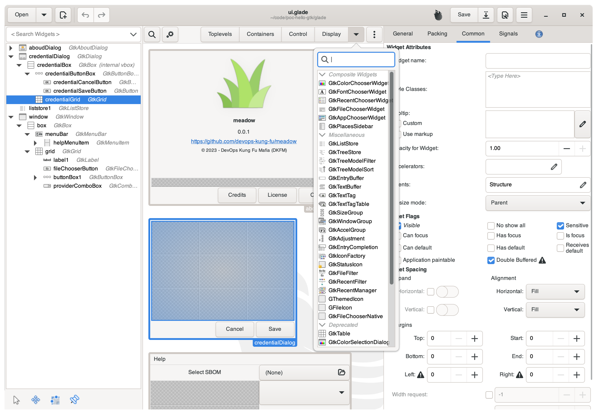

# meadow
[](CONTRIBUTING.md)
 
[](https://goreportcard.com/report/github.com/devops-kung-fu/meadow) 
[](https://codecov.io/gh/devops-kung-fu/meadow) 
[](sbom/meadow.cyclonedx.json)


```meadow``` is an application that generates ```go``` code which connects to [GTK](https://www.gtk.org/) objects as defined in a [Glade](https://glade.gnome.org/) file.

## Overview

Building user interfaces with ```go``` hasn't been the easiest thing to accomplish without a big lift. While searching around the internet for ways to create user interfaces with ```go``` we quickly realized that we could do some cool things with [GTK](https://www.gtk.org/) using [gotk3](https://github.com/gotk3/gotk3). [gotk3](https://github.com/gotk3/gotk3) provides [GTK](https://www.gtk.org/) bindings that allow developers to build user interfaces.

Many of the demos focused on creating user interfaces in code, which seemed a bit tedious. There's a better way to lay things out, and that's with [Glade](https://glade.gnome.org/), which provides a graphical way to build user interfaces and produce and XML file that can be consumed by [gotk3](https://github.com/gotk3/gotk3).

So why did we write ```meadow```? Simply because wiring up all the objects created in [Glade](https://glade.gnome.org/) to usable code was a complete pain. The more complex the interface, the more code that would have to be written to get specific objects from the  [Glade](https://glade.gnome.org/) file and interact with them. ```meadow``` simplifies this by generating beautiful ```go``` code that provides an easy way to interact with the [GTK](https://www.gtk.org/) bindings provided by [gotk3](https://github.com/gotk3/gotk3).

## Glade

[Glade](https://glade.gnome.org/) is a RAD tool to enable quick & easy development of user interfaces for the [GTK](https://www.gtk.org/) toolkit and the GNOME desktop environment.

The user interfaces designed in [Glade](https://glade.gnome.org/) are saved as XML, and by using the GtkBuilder [GTK](https://www.gtk.org/) object these can be loaded by applications dynamically as needed.




```meadow``` reads the XML files output by [Glade](https://glade.gnome.org/) and renders ```go``` code that developers can use to interact with [gotk3](https://github.com/gotk3/gotk3).

## Installation

### Mac

You can use [Homebrew](https://brew.sh) to install ```meadow``` using the following:

``` bash
brew tap devops-kung-fu/homebrew-tap
brew install devops-kung-fu/homebrew-tap/meadow
```

If you do not have Homebrew, you can still [download the latest release](https://github.com/devops-kung-fu/meadow/releases) (ex: ```meadow_0.1.0_darwin_all.tar.gz```), extract the files from the archive, and use the ```meadow``` binary.  

If you wish, you can move the ```meadow``` binary to your ```/usr/local/bin``` directory or anywhere on your path.

### Linux

To install ```meadow```,  [download the latest release](https://github.com/devops-kung-fu/meadow/releases) for your platform and install locally. For example, install ```meadow``` on Ubuntu:

```bash
dpkg -i meadow_0.1.0_linux_arm64.deb
```

## Using ```meadow```

### Validation

In order for ```meadow``` to generate syntactically correct ```go``` code, there are specific requirements that the XML files from [Glade](https://glade.gnome.org/) need to adhere to. The biggest of these is that *every* object needs to have an identifier.

You can check to see if your XML file is valid by running the following command:

``` bash
meadow validate sourcefile.glade
```

### Generation

To generate code for your XML file, simply run the following:

``` bash
meadow generate sourcefile.glade
```
This will create code and by default, place it in a sub-folder of your current working directory (```ui```), name the file ```glade.go```, and the ```glade.go``` file will have a package defined as ```package ui```.

### Flags

There are ways to alter the destination, name, and package name of the generated files. You can do so with the following flags:

| Flag | Description |
|---|---|
| --output-path | Saves the generated ```go``` source to the provided path. (default: ```ui```)|
| --output-file | Saves the generated ```go``` source to the provided file name. (default: ```glade.go```) |
| --package | If defined the ```package``` directive in the source file will be the provided name. (default: ```ui```) |
| --debug | Ouptuts debug information to the terminal while ```meadow``` is running. |

Example:

``` bash
meadow generate --output-path gen --output-filename dkfm.go --package gen sourcefile.glade
```
This will generate a file named ```dkfm.go``` in a subfolder named ```gen``` with a package set to ```package gen```.

## Working with ```meadow```

Sample XML file:

``` xml
<?xml version="1.0" encoding="UTF-8"?>
<!-- Generated with glade 3.40.0 -->
<interface>
  <requires lib="gtk+" version="3.24"/>
  <object class="GtkWindow" id="window">
    <property name="can-focus">False</property>
    <property name="default-width">300</property>
    <property name="default-height">400</property>
    <child>
      <placeholder/>
    </child>
  </object>
</interface>
```

```meadow``` generated code:

``` go

package ui                                                                              

//
// CAUTION: This file was generated by meadow.
//
// Changes made to this file may be overwritten if meadow is run again.
// For more information, check out https://github.com/devops-kung-fu/meadow
//

import (
	"github.com/gotk3/gotk3/gtk"
)

// GtkBuilder returns *gtk.getBuilder loaded with glade resource (if resource is given)
func GtkBuilder(filename string) (*gtk.Builder, error) {

	b, err := gtk.BuilderNew()
	if err != nil {
		return nil, err
	}

	if filename != "" {
		err = b.AddFromFile(filename)
		if err != nil {
			return nil, err
		}
	}

	return b, nil
}

//Window returns the object represented by window in the glade file
func Window(b *gtk.Builder) (*gtk.Window, error) {

	obj, err := b.GetObject("window")
	if err != nil {
		return nil, err
	}

	window, ok := obj.(*gtk.Window)
	if !ok {
		return nil, err
	}

	return window, nil
}

```

Working with the generated code (```main.go```):

``` go

package main

import (
	"fmt"
	"os"
	"path/filepath"

	"github.com/gotk3/gotk3/gtk"

	"github.com/devops-kung-fu/hello-meadow/ui"
)

const sourcefile = "glade/ui.glade"

func main() {

	gtk.Init(&os.Args)

	path := filepath.Dir(os.Args[0])
	filename := filepath.Join(path, sourcefile)

	builder, err := ui.GtkBuilder(filename) // gets a builder from the generated code
	if err != nil {
		panic(err)
	}

	window, err := ui.Window(builder) //gets a handle to the Window object
	if err != nil {
		panic(err)
	}

	window.SetTitle("Meadow Demo")
	window.SetDefaultSize(365, 490)
	_ = window.Connect("destroy", func() {
		gtk.MainQuit()
	})

	window.ShowAll() // shows the window
	gtk.Main()
}

```

## Credits

A big thank-you to our friends at [IconJam](https://www.flaticon.com/authors/iconjam) for the ```meadow``` logo.

Description of Glade courtesy provided by [Glade](https://glade.gnome.org/).
